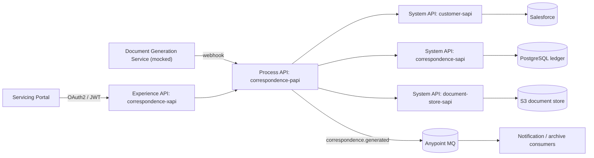

# Architecture Overview — Correspondence Integration Platform

## Problem statement

A retail bank generates ~10,000 customer correspondence items per day (statements, loan
welcome letters, regulatory notices). Requests originate from a servicing portal; rendering
is performed by a document-generation service that notifies completion via webhook. The
platform must guarantee exactly-once generation per request, enrich requests with
authoritative customer data, retain rendered documents, provide delivery tracking, and
publish completion events to downstream consumers — with end-to-end traceability.

## Context diagram

## API inventory

| API | Layer | Responsibility | Backing system | Consumers |
|---|---|---|---|---|
| correspondence-xapi | Experience | Portal-facing request/status; JWT-secured; response shaping | correspondence-papi | Servicing portal |
| correspondence-papi | Process | Orchestration, idempotency, enrichment, event publishing, webhook intake | System APIs, Anypoint MQ, Object Store | xapi, document service |
| customer-sapi | System | Customer/account lookup | Salesforce | papi |
| correspondence-sapi | System | Request/document/delivery ledger CRUD | PostgreSQL | papi |
| document-store-sapi | System | Store/retrieve rendered documents | S3 | papi |

## Key flows

1. **Request:** portal -> xapi -> papi validates, checks the idempotency key, enriches via
   customer-sapi, writes RECEIVED to the ledger, calls the document service.
2. **Webhook completion:** document service -> papi dedupes on event id (Object Store),
   stores the PDF via document-store-sapi, updates the ledger to GENERATED, publishes a
   `correspondence.generated` event to Anypoint MQ.
3. **Status query:** portal -> xapi -> papi -> correspondence-sapi.

## Non-functional requirements

- **Security:** JWT validation at the Experience layer; client-ID enforcement and rate
  limiting on System APIs via API Manager; credentials in secure property files.
- **Reliability:** idempotent webhook handling (Object Store v2); retry with exponential
  backoff and DLQ on event publishing; ledger status FAILED on unrecoverable errors.
- **Observability:** correlation ID propagated on `x-correlation-id` across all layers;
  structured JSON logging; Anypoint Monitoring dashboard with an alert on 5xx rate.
- **Performance:** p95 < 500 ms for status reads; webhook acknowledged < 200 ms with
  asynchronous processing.
- **Environments:** DEV/QA/PROD via per-environment property files; CloudHub 2.0.
